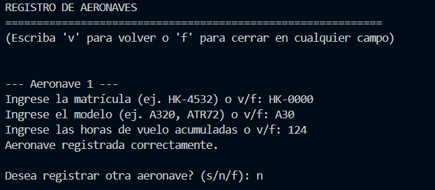
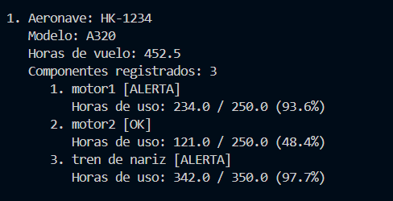

# 📝 Plantilla de Autoevaluación: Gestión de Mantenimiento de Flota Aeronáutica ✈️

**Instrucciones para los estudiantes:**
1. Hagan una copia de este archivo y guárdenlo en la raíz de su repositorio con el nombre `AUTOEVALUACION.md`.
2. Lean cuidadosamente cada criterio de la rúbrica.
3. En el apartado **Nota Esperada**, asignen una calificación numérica (de 0.0 a 5.0) que consideren justa para su trabajo en ese criterio.
4. En el apartado **Justificación**, expliquen con sus propias palabras por qué merecen esa nota. Sean críticos y honestos.
5. En el apartado **Evidencia**, inserten pantallazos de la ejecución de la consola, imágenes de su diagrama o bloques de código (usando la sintaxis de Markdown con \`\`\`) que respalden su justificación.
6. Al final, calculen su nota definitiva esperada según los porcentajes.

---

## 👥 1. Información del Equipo

* **Miembro 1:** [Samuel Mejía Bravo] - [000531329]
* **Miembro 2:** [El Espíritu Santo] - [000000]

---

## 📊 2. Evaluación por Criterios

### Criterio 1: Diagrama y Lógica (Valor: 20%)
*Evalúa si el diagrama es claro, lógico y representa fielmente la estructura de datos utilizada (listas/diccionarios) y el flujo del programa.*

* **Nota Esperada (0.0 - 5.0):** [0.0]
* **Justificación:** 
  > *Entiendo el sistema de los diagramas y mi programa en sí pero la verdad, como está explicado en el README y en entregables, le metí MUCHO tiempo al proyecto solo y la verdad el tiempo no me dio para el diagrama.*
* **Evidencia:**
  *Inserta aquí la imagen de tu diagrama (ej. ``) y explica brevemente cómo se conecta con el código.*

### Criterio 2: Uso de Estructuras (Listas y Diccionarios) (Valor: 30%)
*Evalúa si se utilizaron diccionarios y listas de manera correcta y anidada para almacenar los datos ingresados por el usuario, sin redundancias.*

* **Nota Esperada (0.0 - 5.0):** [5.0]
* **Justificación:**
  > *Considero que le metí MUCHO tiempo y esfuerzo a trabajarle a un programa en el que es fácil moverse si se necesita corregir algún error, añadir algo o eliminar algo. TODAS las funciones tienen un título descrptivo y están bien separadas en archivos diferentes para mejorar eficiencia y fácilidad de hacerle mantenimiento algo. Además, usé archivos .json para guardar los datos ingresados por el usuario.*
* **Evidencia:**
  *Pega aquí el fragmento de código exacto donde inicializas y llenas estas estructuras. Usa el formato de código de Markdown:*
  ```python
    Realmente son muchas funciones las que lo hacen así que voy a poner una de ejemplo, esta es para registrarle componentes a una aeronave y si se presiona "f" en vez de un nombre de aeronave, se sale del programa, si se escribe "v" se vuelve al menú principal.
        nombre_componente = input(f"Nombre del componente {numero_componente} (v para volver, f para cerrar, o fin para terminar): ").strip()
        
        if nombre_componente.lower() == "f":
            raise SalidaPrograma()

### Criterio 3: Cumplimiento de Restricciones Técnicas (Valor: 20%)
*Evalúa el respeto total a las reglas: uso de ciclos clásicos (for/while), cero uso de list comprehensions, y ninguna librería/función avanzada no vista en clase.*

* **Nota Esperada (0.0 - 5.0):** [5.0]
* **Justificación:**
    > La verdad no tengo idea de qué es una list comprehension e hice el programa yo mismo entonces estoy seguro que no añadí nada de eso. No sé la verdad si añadí algo más avanzado, no creo haberlo hecho porque mi nivel de programación es lo visto en este curso y las cosas que voy aprendiendo yo por aparte de a poquitos.
* **Evidencia:**     
    # Cargar componentes desde archivo separado
    componentes_dict = cargar_componentes_json()
    
    componentes_criticos = []
    componentes_alerta = []
    

### Criterio 4: Funcionalidad del Código (Valor: 15%)
*Evalúa si el programa pide datos correctamente, no se "crashea" y genera el reporte final de mantenimiento esperado.*

* **Nota Esperada (0.0 - 5.0):** [5.0]
* **Justificación:**
    > El programa es perfectamente funcional y si quisiera usarse como una base de datos de verdad incluso se puede importar a postgresql que ya aprendí a usarlo. Guarda cuantas aeronaves y componentes el usuario desee, entrega alertas de mantenimiento próximo o urgente y premite la modificación de datos sobre componentes o aeronaves.
* **Evidencia:** *Inserta aquí 1 o 2 pantallazos () mostrando la terminal donde se vea:*



### Criterio 5: Preparación para Sustentación (Valor: 15%)
*Aunque esta nota la dará el profesor en la entrevista oral, autoevalúen su nivel de preparación y comprensión del código que entregaron.*

* **Nivel de Confianza (Bajo / Medio / Alto):** [5.0]
* **Justificación:**
    > Al haberle metido tanto tiempo, esfuerzo y cabeza a este proyecto; me siento perfectamente preparado para sustentarlo, lo conozco "de pe a pa".
* **Evidencia de preparación: Describan brevemente qué estrategia usaron para asegurar que ambos dominan el código (ej. "Nos turnamos para programar (Pair programming)", "Comentamos línea por línea el script final", etc.).**
Nada, con meterle tanto tiempo siento que conozco esto lo suficiente como para poder justificarlo sin preparación alguna. Diría que la manera que utilicé de separar las cosas ayuda a sustentar el proyecto porque es fácil llegar a todo.

### 📈 3. Cálculo de Nota Definitiva Esperada
Multipliquen la nota asignada en cada criterio por su porcentaje respectivo y sumen los resultados para obtener su nota final esperada.

|Criterio	|Nota |Asignada	|Peso	|Subtotal |(Nota * Peso) |
|---|---|---|---|---|---|
|1. Diagrama y Lógica	|[0.0]	|20% |(0.2)	|[0]|
|2. Uso de Estructuras	|[5.0]	|30% |(0.3)	|[1.5]|
|3. Cumplimiento Restricciones|	[5.0]	|20% |(0.2)	|[1]|
|4. Funcionalidad	|[5.0]	|15% |(0.15)	|[0.75]|
|5. Sustentación (Estimado)|	[5.0]|	15%| (0.15)|	[0.75]|

NOTA FINAL ESPERADA		100%	[4.0]

✨ ""La educación es para el carácter, no solo para la mente"." ✨

PD: Qué gran frase la de cierre de esta autoevaluación.